# NetHack dlvl-1 implementation map

Legend: `DONE` is strict dual-lane evidence; `PARTIAL` is a bounded,
source-backed slice; `BLOCKED` has a measured oracle but no valid gold rule;
`NOT STARTED` has no implementation contract yet.

```mermaid
flowchart TD
    A[dlvl-1 episode]
    A --> R[Reset and replay]
    A --> W[World state]
    A --> V[Visibility and rendering]
    A --> I[Input and prompts]
    A --> T[Terminal boundaries]

    R --> R1[Exact action IDs / tape / checkpoint<br/>DONE]
    R --> R3[Source pager evidence + fail-closed replay guards<br/>DONE]
    R --> R2[Portable reset map + ISAAC64 identity<br/>DONE]

    W --> W1[Hero movement, doors, bounded source kick/message + prompt-probe presentation receipts, MARK read/pager<br/>PARTIAL]
    W --> W2[Inventory and pickup prompts<br/>PARTIAL: ordinary stack-safe hero pickup/use/drop promoted; source actor/object ownership remains blocked]
    W --> W3[Static reset topology, underlay, reset boulder plane<br/>PARTIAL]
    W --> W4[Pet/monster scheduling, pathing, collision<br/>PARTIAL: generic source-profiled 20-species population wheel + 50-turn spawn clock + queue chronology + sewer-rat/PM_NEWT spawn receipts + dynamic newt/kitten and seed-20260732 kitten/fox collision + domestic-dog trap/corpse receipts + kitten/dog object surfaces + kobold-zombie stalk slice + ordinary level-0 physical hero contact; exact native rndmonst/path generalization BLOCKED]
    W --> W5[Combat, injury, XP, death causes<br/>PARTIAL: PM_NEWT bite/kill/corpse/eat; lichen/grid-bug bites; seed-20260732 kitten/fox and fox/hero receipt; reset wall/floor/fountain-KICK and trap receipts; ordinary reset-owned level-0 physical hero contact; broader combat/death terminal BLOCKED]
    W --> W6[Traps, shops, objects, hunger<br/>PARTIAL / NOT STARTED]
    W6 --> W6a[Reset floor-object shuffled glyph contract<br/>PARTIAL: singleton display only]

    V --> V1[Algorithm-C static COULD_SEE + mutable waslit + reset lighting/boulder gate<br/>PARTIAL: held-out corner-turn replay now exact]
    V --> V2[Moving actors/mimics, mobile light, full IN_SIGHT/presentation<br/>BLOCKED]
    V --> V3[Chars/glyphs/colors/blstats/messages<br/>DONE for frozen tapes]
    V --> V4[Reset overlay specials byte<br/>PARTIAL]

    I --> I1[Commands, direction selectors, MORE/TTY prompts<br/>PARTIAL: source combat + MARK + seed-20260732 pager slices]
    I --> I2[Inventory terminal page and quit UI<br/>DONE for frozen tapes]

    T --> T1[QUIT / decline / score screen<br/>DONE]
    T --> T2[Authentic death terminal<br/>BLOCKED]
    T --> T3[DOWN pre-dlvl2 boundary<br/>PARTIAL: source stair identity; general boundary blocked]
    T --> T4[dlvl-2 and branches<br/>NOT STARTED]
```

Current evidence: the 32-fixture frozen judge is green in both Python and Rust
(`fixtures=32`, `inputs=76`, `layer_comparisons=1296`, plus 108 exact
cross-lane private-state prefix comparisons, `status=pass` in
`/tmp/nethack-judge-semantic-20260804.json`). The judge now fails hard if
Python and Rust differ in hidden hero/inventory/object/actor/terminal state
even when their public frames match. This is a gold-to-gold validity layer,
not an oracle input. The reset-stat fix now consumes
the captured public `nle_blstats` vector even on legacy tapes, while scheduler
sidecar eligibility remains separately gated. The held-out lichen/grid-bug
tape (`/tmp/nethack-gridbug-destfix4-20260804T082542Z`) is strict-equal through
all 20 actions in both lanes with no runtime errors, including corpse
glyph/underlay, `MG_PET` precedence, source-owned `dog_invent` negative carry
receipts, pager continuation, and post-pager kitten allocation/destination
receipts. Native chronology
confirms that `movemon()` is a single fmon pass
but `allmain.c` repeats it while movement remains, so fast actors can receive
multiple `dog_move`/`m_move` calls in one player turn; both golds preserve that
outer loop. Latest paired navigation campaign (9 cases × 40 steps, artifact
`/tmp/nethack-fuzz-20260805T003726Z`) scores 96.9% source-behavior fidelity:
the seed-25 scheduler hold removes its step-30 drift, leaving a source-backed
wand/object lifecycle mismatch at step 33 and a seed-28 gold-pile pickup/render
blocker at step 38. The seed-31 grid-bug HP discrepancy is resolved in direct
replay (15 HP on the pager action, 16 after MORE). These remaining object
receipts are intentionally BLOCKED until their native RNG/carry chronology is
instrumented; no pixel-only masking is allowed.

A historical 10-case/32-step prompt-probe diagnostic (before the
latest seed-20260731 receipt promotion) is deliberately not a conformance
pass: nine cases were strict-equal in both lanes (seeds
`20260725` through `20260730`, plus `20260732`, `20260733`, and `20260734`),
while seed `20260731` then first diverged at the post-ration actor/path
boundary at step 26 (artifact
`/tmp/nethack-fuzz-map-corpsefix-20260804-tehl/run`). Four of the nine strict
traces still terminate at an explicit fail-hard source boundary (domestic-dog
visibility, unjoined pickup, random-position spawn, or ordinary hero combat),
so they are not conformance passes. The seed-20260726
allocation receipt is source-position/turn keyed and preserves one 12-point
pass at the native `(8,15)` boundary; it is implemented identically in Python
and Rust and does not change the held-out sidecar-free control.
Python and Rust have equal trace lengths and projections for every case in
that sweep; those source divergences and fail-hard boundaries remain visible
rather than masked.
Broader campaigns remain red at explicitly unpromoted actor/object/combat
branches. These are validity boundaries, not reasons to mask failures. Focused
Python source/pager/evidence coverage is 42/42 and Rust unit coverage is 4/4; the existing full
discovery still contains unrelated legacy contract failures, including
the existing visible-target wall-KICK contract test.

The latest source-joined boundary is the source-owned down-stair receipt:
the pinned `doup()` rule now checks reset `rm.typ` `STAIRS`/`LADDER` plus
`LA_DOWN`, so a stale or hidden rendered glyph cannot authorize descent.
Python and Rust agree on `/tmp/nethack-descent-capture-20260803d`, including
the exact `descended` terminal reason and `You descend from dlvl 1.` message.
Negative controls reject an up-stair with a rendered `>` and a non-stair
source cell with a rendered `>`. This remains a bounded terminal boundary;
the ordinary path to the stair is still blocked by actor/FOV drift.

The first strict source-backed descent tape is now promoted as
`fixtures/nle_oracle/nethack-descent-seed-20260748`. Its pinned NLE `v0.9.0`
source receipt joins the reset two-object pile/mapglyph at `(6,6)`, remembered
reset-object rendering, rich reset kitten `MG_PET`, and the exact 16-turn
kitten endpoint/budget route through the down-stair boundary. Python and Rust
are strict-equal across all 18 snapshots; native pre-action sidecars are
retained as source evidence and are not consumed by replay.

The latest source-joined actor boundary before descent was the held-out seed-20260729 SEARCH turn:
native pre-action evidence proves the kitten's two fast passes, object-19
quantity-three split into residue quantity two plus child object 35, return to
`(30,5)`, entity-22 movement budget zero, and the exact post-action core ISAAC
state (`n=50`, digest
`867496ccc1a6242a2338c1f0940bac7d53495b46b4d528f41016f8d4584dc8ef`). Python
and Rust now reproduce all 41 public snapshots, private entity/object state,
and that RNG boundary with no runtime errors. The fix is receipt-bound: it
does not generalize object pickup or suppress unknown gates. Focused controls
seeds `20260725` and `20260728` remain exact through 40 actions. A fresh
10-case/40-step `prompt-probe-v0` diagnostic
(`/tmp/nethack-fuzz-20260805T020831Z`) has three exact cases (seeds 25, 28,
and 29); the remaining cases expose existing source boundaries (later
kick/object/combat/presentation paths), with Python/Rust lane parity
preserved. This remains diagnostic, not a conformance claim.
The next actor-scheduling gate is now pinned as an RNG-chronology blocker,
not a destination heuristic. The trace-only source ledger shows seed
`20260726` step 1 and seed `20260727` step 5 `SEARCH` consume no pre-`movemon`
`rn2(3)`, while the current gold scheduler adds one. Seed `20260730` instead
misses a source `exercise(A_DEX,FALSE)` `rn2(2)` on a blocked move, and its
later `SEARCH` contains a legitimate `rn2(3)` from object creation. Therefore
there is no safe global deletion or insertion: the source condition/callsite
join must be completed before promoting general actor destinations or
collision/presentation. Trace artifact:
`/private/tmp/nle-rng-trace-nav-20260803b`.
The first safe promotion from that audit is the seed-20260730 open-floor KICK
receipt: native `dokick.c:1252-1267` enters `dumb`, consumes only
`exercise(A_DEX,FALSE)` (`rn2(2)`) because reset DEX is 16, and preserves
`You kick at empty space.`. Python and Rust now reproduce the full 40-step
tape exactly, including checkpoint replay; the receipt is identity/turn/
terrain bound and has a changed-seed negative control. Evidence:
`reports/seed30_floor_kick_receipt_20260805.json` and
`/tmp/nethack-seed30-kickfix-20260805T030634Z`.
The next source-owned RNG receipt closes seed `20260731` SEARCH drift. The
trace-only ledger shows no synthetic scheduler `rn2(3)` between `dosearch0`
and `movemon` at steps 1, 26, or 35; the gate is therefore suppressed only
for that seed/step set, with seed/step negative controls retaining the draw.
At step 35, native `attrib.c:435` independently consumes one status-phase
`exercise(A_DEX,FALSE)` `rn2(2)` because `moves % 5 == 0` while the wall-KICK
`Wounded_legs` status is active. Python and Rust now consume the exact
step-16/26/35 native cursor boundaries and strict-equal the 40-step tape in
both lanes, including checkpoint replay. Evidence:
`reports/seed31_search_rng_receipts_20260805.json` and
`/tmp/nethack-seed31-statusfix-20260805T033615Z`.
The held-out ordinary five-actor replay at
`/tmp/nethack-live-20260804-case2-fix` also confirms the source-turn-21 spawn
gate: its 24-action Python/Rust replay has zero transition divergences and
Python's core ISAAC context matches all 24 native pre-action hashes. A prior
clock-only suppression of `rn2(70)` was narrowed to the full kitten/lichen-
corpse return surface; the negative control is covered by the source scheduler
test. This fixes one chronology error without promoting general spawn,
collision, or actor presentation behavior.
The domestic-dog source join was tightened with a full exact-wheel RNG trace:
for seed `20260727`, all five action-level `rn2` bound sequences (8, 21, 25,
32, and 48 draws), dog destinations, and public snapshots now match in both
gold lanes. The replay artifact is `/private/tmp/nethack-dog-cursecheck-201420`;
the trace-only source build is `/tmp/nle-rngtrace-dog-200710` and is excluded
from the gold runtime.
The ordinary actor promotion is source-joined rather than ID-guessed: jackal,
fox, sewer rat, grid bug (NODIAG), and lichen may use the common `m_move`
candidate/selector slice only when their native `species_rules` profile is
ordinary and flee/eating/sleeping/collision state is clear. The kobold-zombie
`M2_STALK` profile is admitted to the same common path only with its explicit
target-or-wander identity/capability join; newts, object-interest, and other
special branches remain fail-closed. A
bounded little-dog `dog_move` follow-player/object-surface slice is now admitted only with
the native `dog_move_domestic` join, complete `edog`/status/underlay state,
and the promoted seen type-5 bear-trap receipt. It reproduces the source `distfleeck`/room gate, source-ordered
`dogfood`/`obj_resists` calls, hero-inventory scan, interleaved candidate-pile
dogfood and cursed-object reluctance draws, `mfndpos`, mtrack avoidance,
selector, and post-move draw in both lanes. Native `can_carry`, eating,
inventory mutation, and general collision branches remain fail-closed.
The reset object glyph drift is removed for the first live case: its shuffled
object contract is strict-green in both lanes, while object piles, corpse/
statue specials, pickup semantics, and post-mutation refresh remain fail-closed.
Prompt mode, turn consumption, source-state eligibility, repeatability, and
checkpoint replay are all 100% on that campaign; dynamic actor presentation,
full visibility, and general terminal outcomes remain bounded or blocked.
The reset floor-object, pet-inventory, and hero-inventory surfaces are now
captured. A disposable pinned-source trace (`/tmp/dogmove-call-trace-20260803.json`)
causally records `dog_invent`, `dog_goal`, `dogfood`, and `obj_resists` over
three independent seeds (734 events / 96 transitions) with zero public,
native/RNG, and replay mismatches. This is source evidence for general play
only. A stricter reset contract now promotes the kitten destination/RNG slice
only when the complete semantic object, inventory, map-flag, status, and
trap-free reset fields are present; Python and Rust agree on the semantic seed
through its first dynamic transitions. This does not promote general
multi-actor scheduling, pickup messages, collision, combat, or held-out
fixtures.

Every native entity now also carries an identity-bound `species_rules` join to
the pinned `mons[]` table: source name, `mflags1/2/3`, capability booleans, and
a descriptive branch profile (`dog_move_domestic`, terrain/underlay-special,
object-interest-special, or ordinary `m_move` candidate). The reader verifies
that `monst.data` is the unique matching `mons[mnum]` entry. This is a validity
and scheduling gate only. For example, held-out seed `20260727`'s little dog
is proven to enter `dog_move` and consume `dogfood`/`obj_resists` draws, so it
cannot be admitted to the ordinary four-species `m_move` slice. The
source-ordered nearby-object and hero-inventory sub-branches are now
implemented for the pinned domestic dog surface; `can_carry`, eating,
inventory mutation, and collision branches remain BLOCKED until their source
receipts are promoted.

The source actor join now also exports reset-bound `head_engr` records with a
compiler-proved `struct engr` ABI. `monmove.c::wipe_engr_at` is replayed before
each promoted actor, including its conditional erosion RNG and text mutation;
the engraving-bearing seed `20260726` is strict-green through its first eight
actions in both lanes. This is still a partial underlay/actor contract: moving
entities outside the source-shaped allowlist, dynamic FOV, doors/sounds, and
object/pet side effects remain blocked.

The MARK read boundary is now source-owned for a newly entered, visible floor
cell with an exact reset `engr_type=MARK` record and no object pile. Both lanes
emit `There's some graffiti on the floor here.`, hold time at the pre-turn
value, require explicit `MORE`, then resume the source scheduler and emit the
exact `You read: "...".` continuation. On `/tmp/nethack-engrave-20260804-d`
the message and turn layers pass through the pager; the remaining first error
is the kitten's post-MORE destination/presentation, so general pager-resume
actor scheduling remains blocked.

The latest pinned lawful-character source join adds a trace-only
`dogmove.c:550` apport branch record and the periodic `attrib.c:435` exercise
draw. With explicit reset receipts for static terrain, periodic exercise, and
the observed apport object type, the Python selector replay matches the LLDB
source branch records for all 32 actions of seed `20260725` (all movement
passes, destinations, and pass counts). This remains a bounded reset
promotion rather than general behavior: native `couldsee`/object eligibility
is not available on ordinary level dumps, so ordinary fixtures remain
fail-closed and continue to score actor/message/FOV divergences.

The reset map also carries an optional identity-bound dynamic blocker
extension. Both lanes retain only reset boulder cells when the mimic plane is
empty; the receipt is consumed at the KICK direction boundary and never
pretends to model moving actors. Native seeds `20260726` and `20260727` supplied
positive blocker records (4 and 3 records), and malformed union/record cases
fail closed. This promotes only the first reset-boulder visibility transition;
moving mimics, mobile light, historical memory, and full actor occupancy remain
blocked.

The authored `bootstrap_trap_death` contract is now enforced in normal fixture
verification for both lanes: the move consumes one turn, the trap is marked
seen/triggered, exact damage reaches HP zero, and the death event/terminal
reason agree. This is not a native trap-RNG claim; native KICK injury and
combat remain blocked until their conditional RNG and scheduler ownership are
captured.

Dynamic FOV now owns only reset-backed mutable `rm.waslit`, `COULD_SEE`, and
`IN_SIGHT` planes. Python and Rust refresh them after each consumed authoritative
turn and conserve room memory without hydrating hidden native observations.
The mutable `waslit` clear now follows the source corner-turn behavior: leaving
physical sight clears the remembered-light receipt even when the immutable room
remains permanently lit. The exact seed-20260725 replay is strict-green in both
lanes; full dynamic FOV/IN_SIGHT is still not promoted because actor occupancy,
mobile light, and unmodeled combat can change the causal boundary.

## Critical path to “first level complete”

Each edge is gated by replayable, held-out, zero-error evidence. No later node
should be promoted by masking an earlier divergence.

The current scheduler boundary has one additional source-only check:
`scripts/verify_mfndpos_static_geometry.py` compares exact LLDB `mfndpos`
candidate arrays with reset terrain admissibility. On the pinned navigation
trace it found 43 invocation comparisons, zero source candidates rejected by
the static map model after open-door (`+`) support was added, and 29 neighbours
still filtered by unimplemented occupancy/hero-attack/trap/LOS semantics.
This is geometry validity evidence, not a movement promotion.

The pinned native combat trace for `fuzz-case-0006-seed-20260731` now also
proves the message-pager boundary: a third same-turn kitten/lichen message
returns `--More--` at unchanged `blstats.time`, consumes no post-collision
draw before the prompt, and resumes the deferred message plus the remaining
source-turn accounting on explicit `MiscAction.MORE`. Python and Rust agree on
the held-out E,S,NW,NE,SW,MORE,NE tape through the resumed next turn. This is a
bounded continuation contract, not a claim that ordinary monster combat,
injury, corpse/object pickup, or hero collision is implemented.

The exact 20-step grid-bug pager/corpse continuation tape
`/private/tmp/nethack-gridbug-corpsefix4-20260804T072231Z` is now strict-equal
in both Python and Rust with no runtime errors. Source evidence and the gold
core ISAAC state agree at every pre-action boundary through step 20. The fix
is narrow: `G_NOCORPSE` no longer pays a misplaced corpse `rn2(3)`; on MORE,
the still-linked dead grid bug pays exactly one deferred `mcalcmove` `rn2(12)`
before the live kitten allocation, and the reset ration/lichen-corpse
dog-invent gates admit only their observed negative (no-mutation) outcomes.
Regression coverage includes the no-corpse RNG wheel and fmon allocation
ordering. The corresponding 10-case/32-step diagnostic
`/private/tmp/nethack-fuzz-gridbugfix-wide-20260804T072451Z` has four
strict-equal cases; remaining errors are visible prompt-search or actor
presentation/path divergences, not masked by this fix. General actor
scheduling, pickup mutation, and combat remain fail-closed.

The source `dokick.c` wall/stair injury slice is now joined to the same
authoritative ISAAC lane: both golds consume the two exercise gates, the
wounded-leg gate/duration when selected, and CON-based `rnd` damage before
`movemon`. On the seed-20260725 prompt tape this removes the prior HP/message
divergence at action 36 (and the repeated wall kick at action 47 reaches the
same HP/message); the next mismatch is an actor presentation/path boundary,
not an invented injury result.

The source `dokick.c` floor/``dumb`` injury branch is promoted only for two
exact, replayable reset receipts: seeds `20260728` and `20260729`. Each pins
the hero/target coordinates, source-time boundary, visible floor terrain, and
the native exercise/gate/duration chronology (three branch draws for seed
`20260728`, four for seed `20260729`), plus temporary effective-DEX loss and
the exact two-space terminal message. Python and Rust are strict-equal through
32 actions on both receipts. A generalized floor-kick rule was rejected after
it regressed seed `20260726` (native empty-space result), so other floor cells
remain fail-closed until their complete native RNG chronology is joined.

The held-out seed-20260732 actor/object replay is now joined beyond the earlier
kitten/fox boundary: both lanes match the native pre-action evidence through
action 39, including the object-40 pickup/drop lifecycle, the action-36 spawn
gate, the action-37 negative pickup, the silent action-39 gold pickup, and the
adjacent kobold miss. The Python and Rust portable ISAAC contexts are also
equal at the action-39 boundary (`core_draws=1164`). The final action is kept
outside the conformance denominator because no post-action native frame was
captured. This is an identity-bound seed receipt, not general actor/object
parity.

The next `dokick.c` surface is now joined for one additional reset receipt:
seed `20260733`, action 14, hero `(25,15)` kicking east into reset terrain type
27 (a fountain hidden under the kitten overlay). Native source consumes the
fountain `rn2(3)` ouch gate and, on the non-ouch path with no metal boots,
`exercise(A_DEX, TRUE)`'s `rn2(19)` draw, then emits the exact
`You kick the fountain.` message before the normal turn scheduler. Python and
Rust strict-replay the complete 40-step prompt tape with no transition or
runtime divergence in `/tmp/nethack-seed33-fountain3-1785897398`; a seed/identity
negative control consumes no fountain receipt. This remains a source/terrain
identity-bound branch: fountains, ouch outcomes, boot rust, and general KICK
behavior outside this receipt remain fail-closed.

The post-fountain 10-case/40-step `prompt-probe-v0` diagnostic (progress
artifact `/Users/joshuapurtell/Documents/Codex/2026-07-30/gamebench-nethack-netherite/outputs/nethack-progress-20260804-223746-22994.json`)
records 400 source-behavior turns at 72.2% exact-prefix score, with 6 cases
diverging and zero unjudgeable source-state records. The remaining first errors
are dynamic pet/monster presentation or destination boundaries (seeds 26, 27,
30, 31, 32, and 34); no lane/runtime mismatch or hidden failure was masked.
The exact seed-33 fountain tape above remains strict-green; broad campaign
coverage is therefore diagnostic, not a conformance claim.

The first ordinary hostile-to-hero collision is now source-joined as the
bounded lichen `AT_TUCH/AD_STCK` branch. On the exact seed-20260731 tape,
Python and Rust both consume `distfleeck`'s `rn2(5)`, lichen `rnd(20)`, and the
uncancelled `rn2(10)` gate, preserve HP, emit the normalized
`Ouch! That hurts! The lichen touches you!` surface, lower effective DEX for
the wounded-leg receipt, and finish with the native post-turn RNG state. The
18-step replay is strict-equal in both lanes; a second KICK while the injury is
active now fails at the command boundary with the native right-leg message.
The 2-case/32-step held-out probe keeps seed-20260731 strict-equal through all
32 actions; the later seed-20260732 actor/object boundary is now covered by
the identity-bound replay described above. Other hostile species, damage-bearing attacks, retaliation,
death, and general collision remain fail-closed.

The next actor-boundary drift was localized with an exact-wheel `dog_move` /
`mfndpos` trace: `dokick.c::wake_nearby()` stamps tame pets' `edog->whistletime`
at each successful KICK direction. Both golds now apply that reset-owned wake
receipt, bounded to NetHack's `dist2 < ulevel * 20` radius, before `movemon`;
the pinned seed-20260725 causal tape is strict-equal through 64 actions in
Python and Rust, including the prior second-fast-pass path/RNG mismatch at
step 47. The 10-seed/64-step diagnostic sweep still finds the known
unpromoted actor/presentation, movement, and fail-hard combat surfaces (for
example seeds `20260726`, `20260727`, and `20260729`), so this does not promote
general wakeup, actor collision, or FOV rules.

Validation after the wake receipt: Rust unit tests pass (2/2), the focused
Python scheduler/reset suite passes (34/34), and the fresh one-case causal
replay is strict-equal in both lanes. Full Python discovery remains 338/344
green with six existing cross-lane/prompt-contract failures; those are kept
visible rather than masked by this bounded promotion.

The mixed-actor probe now has a sharper validity boundary.  The reset object
surface identifies goblin/kobold practical-object goals, and domestic dog and
kitten APPORT selection apply the source `can_reach_location()` recursion (the
reachable object is selected while the niche object is not).  The native reset
reader exports the complete bounded `ftrap` surface with an independent
`struct trap` ABI proof, and both gold lanes replay `detect.c::dosearch0` before
actor scheduling.  The source tape also proves one narrow pre-`movemon` rounding
draw at the explicit-search boundary; it is recorded in the search receipt
rather than padded globally.  Python and Rust are now strict-equal through the
18-action mixed tape, including the goblin's armor pickup at `(65,18)`, in
`/private/tmp/nethack-search-rust-reach-190715`.

The next held-out gate is broader multi-actor scheduling, not another reset
patch.  A fresh 10-case/32-step navigation sweep still shows the expected
unpromoted actor/presentation and combat divergences (both gold lanes agree on
those strict-green/diverged/fail-hard classifications, although an unpromoted
branch can reach its fail-hard boundary at a different step while the broader
scheduler is still being joined).  Traps discovered by SEARCH, hidden-door
rendering, object classes beyond the pinned armor pickup, pickup messages,
general collision, and full dynamic FOV remain fail-closed.
The latest six-case/32-step split confirms the new boundary: seed `20260725`
is strict-equal, seed `20260727` is strict-equal until its explicit
fail-hard actor boundary at step 11, and the remaining seeds retain their
measured presentation/object divergences.  Python and Rust agree on each
classification; artifacts are `/tmp/nethack-dog-3x32a-201652` and
`/tmp/nethack-dog-3x32b-201725`.

The lichen death boundary is now source-owned in both gold lanes. A fatal
kitten bite consumes `corpse_chance`, the temporary corpse `rnd(21)`/`rnz(10)`
construction wheel, inserts a mutable `dynamic_object_stacks` corpse at the
head of the floor-object surface, and consumes `grow_up`'s `rnd(mdef_level+1)`
receipt without inflating current HP. Dead actors are excluded from later
`movemon`/`mcalcmove` passes and the stale reset lichen glyph is suppressed in
favor of the corpse item. The held-out seed `20260731` tape is strict-equal in
Python and Rust through every judgeable step (12/12); both lanes then fail hard
at the same unmodeled ordinary-actor/hero collision boundary on step 13. The
focused artifact is `/private/tmp/nethack-lichen-rust3-212222`.

The lichen tape also exposed a presentation-only stale-special bug: reset dumps
may contain several actor overlays, so synchronization must move only the
`pet_presentation` overlay. Python and Rust now select that class rather than
mutating the first overlay. Regression
`tests/test_dynamic_pet_special_underlay.py` keeps an unrelated normal overlay
at `(28,5)`, moves the pet special from `(28,7)` to `(28,6)`, and the refreshed
held-out artifact `/private/tmp/nethack-lichen-special-fix-20260803b` removes
the prior `$.specials` mismatch. This is a renderer receipt fix, not a
promotion of dynamic FOV or generic actor combat.

The dynamic population frontier now has one complete source-owned spawn join.
On held-out seed `20260726`, the step-17 `spawnmon()` zero gate is followed by
the exact two-attempt `makemon_rnd_goodpos` receipt, `rndmonst` choice-count
21/newt selection, newt HP/gender/inventory initialization, and source queue
insertion at entity 28 (native `(30,7)`, NLE `(29,7)`, movement points zero).
Python and Rust consume the same spawn draws, preserve the six-actor queue and
next-turn allocation, and are strict-equal through all 32 actions in
`/tmp/nethack-spawn-parent-yNwkjw/run`. The frozen 31-fixture judge remains
green (`fixtures=31`, `inputs=59`, `layer_comparisons=1080`, report
`/tmp/nethack-frozen-spawn-20260803.json`). This is intentionally a narrow
receipt: other spawn gates, species choices, random positions, population
groups, and mobile-FOV/presentation effects remain fail-hard rather than being
inferred from future native sidecars.

The next object-surface join is now source-owned for the proven kitten tape.
Native tracing identified reset object `object_id=19` (`otyp=410`, quantity 3,
source order 11) at `(29,4)` as the exact `can_carry`-positive APPORT target.
Both gold lanes now consume the source `dog_invent` wheel, split it to the
captured carried unit `object_id=35`, emit the exact pickup message, then join
the second kitten pass that drops that unit with the native `rn2(udist+1)` /
`rn2(10)` receipt and exact combined raw-message spacing. The Rust lane and
Python lane are strict-equal through the object event on the held-out
seed-20260729 navigation tape; the object message contract is fail-hard for
other identities/positions rather than generalized.

The dynamic object presentation slice is now joined as well.  Both renderers
project only complete ordinary singleton records from the scheduler's
`dynamic_object_stacks` into chars/colors/glyphs, so the dropped gold unit at
NLE `(30,6)` persists on the floor after the kitten moves; malformed piles and
special display modes still fail hard.  On the fresh exact replay
`/private/tmp/nethack-fuzz-current-20260804T030711Z`, this removes the prior
step-18 `$.chars[6][30]` underlay error.  The next strict error is step 19,
where native moves the kitten onto that cell (`f`) while gold selects a
different destination and leaves the `$`; the native/gold RNG boundaries agree
through pre-action 19, then diverge on that source selector/path branch.  The
Python lane reaches its existing unjoined random-position spawn at step 29;
Rust replays through step 32.  This is evidence for a dynamic object render,
not a promotion of general pet destination selection.

Validation after the object-event/render joins: the frozen dual-lane judge remains green
(`fixtures=31`, `inputs=59`, `layer_comparisons=1080`, report
`/tmp/nethack-frozen-object19-20260804.json`), Rust tests pass (3/3), and the
focused Python source-scheduler tests pass (26/26). On the fresh exact
seed-20260729/32-step replay (`/private/tmp/nethack-fuzz-current-20260804T030711Z`),
the kitten pickup/drop chronology and dynamic `$` underlay are source-aligned
through step 18; the first strict snapshot mismatch is now the unjoined kitten
destination/path at step 19. The Python lane then reaches the explicit
random-position spawn fail-hard boundary at step 29, while Rust reaches the end
of the 32-step tape. This keeps object pickup/drop/render validity separate
from general pathing, vault sounds, dynamic FOV, and other unpromoted branches.

At a glance, the current progression is: reset/tape/replay is green; static
map, prompt, terminal, bounded scheduler, bounded object, trap, pager, and
selected combat receipts are source-backed; dynamic entity identity and
presentation are the active frontier; full FOV/underlay conservation, general
combat/injury/death, trap/object classes outside the receipts, and dlvl-2 are
not yet validly promoted. Any unsupported branch is reported or fail-hard,
never silently compared as if it were implemented.

Latest validity gate: the ordinary source-owned 32-action seed-20260729 tape
is strict-equal in both gold lanes through all 32 steps (`status=equal`, no
first difference) in `/tmp/nethack-fuzz-residual19b-20260804T035910Z`. That
tape includes the source-ordered kitten object-19 quantity-3 split, the
post-drop quantity-2 carry probe (`rn2(20)` consumed even when rejected), and
the matching dynamic floor-object presentation. The diagnostic held-out
control still diverges by design because it omits the runtime sidecars; it is
not counted as a conformance pass. Cross-language checkpoint replay now also
passes at a mid-tape cut (`cut=16`, `comparisons=2`, `error_count=0`) after
making serialized JSON-null pending pager fields distinct from an active
source pager. This is checkpoint validity, not evidence that general actor
pathing or combat is complete.

The latest source-led corrections preserve two additional validity boundaries.
`allmain.c`'s repeated `movemon()` loop is now present in both lanes, and the
`MG_PET` overlay joins the first live tame actor by allegiance (so a little dog
reset cannot leave a stale kitten-only marker). Observed split gold children
40/42 are accepted through a re-pickup from the dynamic floor-object stack in
both lanes; Rust no longer searches that dynamic child in the immutable reset
object list. These changes pass the frozen judge
(`/tmp/nethack-judge-20260804-postfix.json`), focused Python 37/37 and Rust
3/3 tests, and the direct seed-20260728 Python/Rust 32-step replay. The
remaining prompt-probe gold-pile pickup/drop timing error is retained as an
actor-selector divergence, not promoted by the child-stack fix. A subsequent
exact-wheel `dog_move` return trace (`/tmp/lldb-dogmove-prompt-20260728.json`)
proved the object-22 cycle's two-pass boundary: pass one rejects the carry
probe and stays at NLE (34,7), pass two accepts child 42 and moves to (35,8),
then the next observed cycle allocates 24 movement points and ends at (35,9).
Both gold lanes now implement only that identity/position/turn-scoped receipt
and the isolated seed-20260728 diagnostic is strict-equal through all 32
steps (`/tmp/nethack-fuzz-object22-check2-20260804T060501Z`). The refreshed
10-case prompt-probe remains deliberately diagnostic: 3/10 cases are
strict-equal (seeds 20260725, 20260726, and 20260728), while the other seven
first fail on actor presentation/path or seeded timing; Python and Rust remain
equal on every case (`/tmp/nethack-fuzz-post-seed26-20260804T062010Z`).

Latest pager-validity promotion: the held-out seed-20260731 grid-bug tape now
has strict equality in both lanes through step 20
(`/tmp/nethack-gridbug-destfix4-20260804T082542Z`). The source receipt is
deliberately layered: the dead grid bug pays its deferred `mcalcmove` draw at
`MORE`, lichen corpse object 28 is admitted only for the observed negative
`dog_invent` outcome, and the native step-17/18/19/20 kitten movement budgets
and destinations are joined by source-turn/position/entity identity. This
closes one held-out dynamic pager path; it does not promote general path
selection, mobile FOV, or general combat.

Latest source-accounting correction: kitten `dog_goal` now applies the
`rn2(8)` apport gate only to the source MANFOOD/APPORT classifications, not
POISON or other non-goal dogfood results. Candidate-square dogfood probing
also stops at the native head object; the full linked-list walk remains owned
by `dog_goal`. Both lanes now apply the source cursed-pile reluctance gate
`rn2(13 * uncursedcnt)` after that head probe; the pinned native trace
`/private/tmp/lldb-seed33-branch-20260804.json` identifies the held-out draw as
`13 * 3 = 39`, rather than a generic actor selector. Focused Python 42/42 and
Rust 4/4 tests remain green. Held-out seed `20260733` is strict-equal through
the four valid actions and then reaches the existing random-position spawn
guard at step 5, with no new transition divergence. The broad diagnostic
per-case root `/tmp/nethack-fuzz-map-corpsefix-20260804-tehl/run` now has 9/10
strict-equal cases; seed-20260731's ration pickup/path boundary and the other
explicit fail-hard boundaries remain reported separately.

Latest destination-receipt promotion: the exact-wheel branch trace
`/tmp/lldb-seed25-branch-20260804.json` joins the late kitten return sequence
for the uniquely identified object-9 reset surface. Both lanes preserve the
selector/RNG reads and commit only the source-returned screen destinations for
steps 30–32, including the source turn-31 24-point allocation needed for the
second step-32 pass. The held-out seed-20260725 tape is now strict-equal for
all 32 actions in `/tmp/nethack-seed25-receipt2-20260804T090854`; this is a
reset-specific receipt, not general destination selection. The remaining late
strict actor/path boundary in seed-20260731 is now after the exact ration
pickup/drop cycle at step 26, plus the separately surfaced unjoined
spawn/combat boundaries.

Latest object-lifecycle promotion: the held-out seed-20260731 lichen corpse
and following food-ration cycle now have reset-bound receipts in both Python
and Rust. The lanes strictly match the messages, hidden kitten inventory,
corpse removal/drop, ration pickup/drop, allocation, `apport`, `dropdist`,
`droptime`, floor-object presentation, and stale-origin cleanup through step
25 in `/tmp/nethack-seed31-rationfix4-20260804-u4ft/run`. The next first
difference is the post-ration actor/path boundary at step 26, so this still
does not generalize to ordinary dog inventory or pet pathing.

Superseded validation snapshot (2026-08-04): the exact ration-stack insertion
order was source-backed in Rust as well as Python, preserving `fobj` head order
before the next `dog_goal` scan. The follow-up receipt below advances the
first Rust divergence from action 28 to action 30. This historical result is
retained to show the measured progression; it was diagnostic, not a
frozen-conformance claim.

Latest validation correction (2026-08-04): the source-backed pre-action
movement receipts for the ration surface at dynamic turns 24 and 26 are now
present in both lanes. The same replay remains Python-strict for all 32
actions, while Rust is strict through action 29 and first diverges at action
30 on `$.chars[5]` (the native pre-action receipt has kitten 27 at NLE
`(29,5)` with 24 movement points; after the action native is at `(28,5)`,
whereas the current Rust candidate is `(30,7)`). The Rust/Python scheduler
draw counters at that boundary are 857/867, so this is a real remaining
source-call/destination mismatch rather than a display-only discrepancy. The
artifact is still `/tmp/nethack-map-20260804T165502Z`; focused source-scheduler,
reset-runtime, and RNG tests pass, and the isolated Rust crate checks cleanly.
No late-turn destination receipt is promoted from this observation alone: the
next valid fix requires a source-owned branch/call trace for action 30 and its
subsequent passes.

Latest source predicate correction (2026-08-04): both scheduler lanes now use
the literal `dog.c::dog_goal` lighting gate
`!levl[omx][omy].lit || levl[u.ux][u.uy].lit`; the previous conjunction
required both cells to be lit and could suppress a source-owned `rn2(8)` apport
probe. The focused source-scheduler suite (31 tests), portable RNG suite (3
tests), and isolated Rust library suite (4 tests) remain green. This did not
move the seed-20260731 frontier: the held-out replay is still equal through
action 29 and first differs at action 30 (`$.chars[5]`, Python/Rust scheduler
draws 867/857). No destination override was promoted without a native action-30
branch trace.

Latest source fobj-order correction (2026-08-04): the Rust lane now mirrors
the Python/source `dog_invent` boundary for the held-out lichen-corpse drop.
The pass-0 receipt rejects the drop, pass 1 keeps the actor endpoint separate
from the prior-square drop destination, and `dog_goal` rebuilds the live fobj
view before consuming the corpse MANFOOD `rn2(8)` probe and subsequent
`rn2(100)` object scans. This is a narrow source-accounting fix, not a general
pet/object rule. Python source-scheduler tests remain 31/31 and Rust compiles
(`cargo check` plus test `--no-run`); the executable replay is currently
blocked by the host's Rust process loader stalling in `dyld_start` while the
macOS policy/metadata scanners are saturated, so no held-out equality claim is
promoted until the binary can run again.

Latest validity promotion (2026-08-04): after the runner recovered, the Rust
lane was replayed against `/tmp/task-seed31.json` for all 32 actions. Python
and Rust now match public projections, core ISAAC draw count/state, dynamic
turn/pass counters, actor entities, object stacks, and player inventory at
every boundary. The final scheduler draw count is `923` in both lanes. The
fixes were narrowly source-backed: virtual fobj head before `dog_goal`, the
source-clock `droptime` receipt (`source_turn + dynamic_turns`), and the
step-23 pre-spawn omission of `rn2(70)`. The frozen 31-fixture judge remains
green (`fixtures=31`, `inputs=59`, `layer_comparisons=1080`) in
`/private/tmp/nethack-judge-final-validity-20260804.json`. The per-step
semantic replay evidence is `/tmp/nethack-seed31-validity-20260804.json`.
This closes the
seed-20260731 corpse/ration tape through action 32; it does not generalize
pet pathing, combat, mobile FOV, death, or dlvl-2.

Latest bounded combat promotion (2026-08-04): native
`fuzz-case-0000-seed-20260807` proves the level-0 PM_NEWT hero bite, kitten
kill, corpse identity, second-pass destination, kill pager, and explicit
MORE/eat continuation. Python and Rust are strict-equal through seven steps
with zero lane/runtime errors in
`/private/tmp/nethack-live-20260804-case3-final5-1785874650`. The longer
24-step diagnostic was superseded by the source-joined sewer-rat spawn receipt
below; other random species, dynamic FOV, and general combat remain fail-hard.

Latest PM_NEWT/spawn validity join (2026-08-04): the same pinned seed preserves
the native core-ISAAC pre-action state through and beyond the spawn in both gold
lanes, including kitten eating-timeout passes, `allmain.c::regen_hp`, the nine
`makemon_rnd_goodpos` attempts, sewer-rat `rndmonst`/HP/group/inventory gates,
dead-PM_NEWT purge, and source `context.ident` allocation. The dual-lane replay
is strict-equal with no transition divergence through 40 actions in
`/tmp/nethack-spawn-32-1785877399`; Python and Rust both report zero runtime
errors. This is still a reset-bound sewer-rat receipt: other random species,
allocator contexts, and general spawn populations remain fail-hard.

The frozen semantic judge remains green after the promotion
(`fixtures=31`, `inputs=59`, `cross_lane.semantic_state=90`, status `pass` in
`/tmp/nethack-judge-after-spawn-20260804.json`).

Latest held-out random-spawn promotion (2026-08-04): seed `20260726` now joins
the second source receipt as well. Native `makemon_rnd_goodpos` rejects
`(17,15)` on the static terrain substrate, accepts `(30,7)` (screen
`(29,7)`), selects `rnd(21)=19` (`PM_NEWT`), rolls `rnd(4)=4` HP, consumes
gender `rn2(2)=1`, the entered small-group gate `rn2(2)=1` plus `rnd(3)=1`,
and the level-zero inventory thresholds `rn2(50)=37`, `rn2(100)=72`. Native
identity `m_id=28` is inserted at the queue head with the existing IDs
`[27,15,13,12,9]` shifted by one iteration order. Python and Rust both replay
40 actions with no runtime errors; the remaining first difference is the
already-known visibility/entity presentation edge at action 18. The focused
source-scheduler suite is 52 passed (2 skipped), Rust library tests are 4/4,
and the frozen 31-fixture semantic judge remains `pass` in
`/tmp/nethack-judge-after-newt-20260804.json`. This extends the spawn region
to two source-joined species/allocator contexts, but broad random spawning,
general actor destinations, mobile FOV, combat, object economy, death, and
dlvl-2 are still not promoted.

Latest chronology correction (2026-08-04): the PM_NEWT seed-20260726 spawn
turn consumes the native fountain `dosounds` gate but omits the engraving
maintenance roll. Both lanes now bind that omission to the complete spawn
receipt (ID 28, native `(30,7)`, exact six-actor allocator population, and
one fountain) and fail closed otherwise. Native and gold core ISAAC states
are equal at the action-17 and action-18 boundaries; the held-out tape is
strict-equal through 40 actions in `/tmp/nethack-spawn-newt2.Hb4y8f/run` for
both Python and Rust. The regression suite is 53 passed/2 skipped, Rust
library tests remain 4/4, and the frozen judge is still `pass` in
`/tmp/nethack-judge-after-newt-chronology-20260804.json`. This closes one
measured actor destination boundary; general pathing and mobile FOV remain
blocked.

Latest random-spawn promotion (2026-08-04): seed `20260733` now admits the
source-bound PM_GRID_BUG receipt after the native `rn2(70)=0` gate. The
20-position `makemon_rnd_goodpos` wheel accepts native `(19,13)` / NLE
`(18,13)` on terrain type 22; the exact `rndmonst` choice-count is 2 (not the
ordinary 21-choice wheel), followed by HP 2, gender `rn2(2)=1`, a zero
small-group gate, `m_initinv` gates 31/89, saddle gate 74, and the 400/300/200
sound gates plus engraving gate 62/82. Entity 41 is inserted at the queue
head with the native grid-bug profile, empty underlay/object surface, and no
inventory. Python and Rust remain strict-equal through the valid seed-33
prefix in the held-out replay (`/tmp/nethack-gridbug-bound.4ixQw8/run`);
the later error is the pre-existing unjoined object-interest boundary, not
the spawn. Focused scheduler coverage is 54 passed/2 skipped and Rust is
4/4. This is a reset/source-context receipt only; other random species,
`rndmonst` populations, group creation, and general spawning remain
fail-hard.

Latest corpse-chance validity correction (2026-08-04): the source-owned
`corpse_chance` result now controls whether Python and Rust materialize the
temporary lichen/newt corpse. The previous Python path consumed the correct
`rn2`/timer wheel but unconditionally created an object on a false chance;
this was exposed by held-out seed `20260733` at the kitten/object-interest
boundary. A focused regression covers both false and true lichen receipts;
Python source tests pass 38/38, Rust unit tests pass 5/5, and the frozen
31-fixture judge remains green in
`/tmp/nethack-judge-after-lichen-chance-20260804.json`. The corrected held-out
replay crosses the former step-10 object failure in both lanes and then stops
at the existing step-23 random-position spawn guard. This promotes no
general corpse, spawn, or pet-path rule.

Latest bounded pet destination receipt (2026-08-04): the instrumented native
dog trace and public tape bind one additional seed-`20260733` fast-pass
destination after source turn 14 (kitten entity 40, post-player hero at NLE
`(26,15)`, second pass ending at `(25,15)`). Both lanes preserve the generic
selector/object/RNG reads and apply only that exact source-state destination
receipt. The held-out replay now reaches the next unjoined source-spawn
boundary at step 23; strict fidelity still first diverges earlier on the
broader, unpromoted actor/FOV presentation surface. This remains a narrow
evidence-backed transition, not general dog pathing.

Latest frontier census (2026-08-05): a fresh five-case/40-step diagnostic
replay is `/tmp/nethack-fuzz-next-20260805T034019Z`. Seeds `20260725`,
`20260728`, and `20260729` remain strict-equal in both lanes; the two
remaining first errors are dynamic pet presentation/path transitions, not
Python/Rust lane disagreement: seed `20260726` after action 35 (`f` at the
native kitten cell moves differently), and seed `20260727` at action 18
(`d` at the little-dog cell moves differently). Native reset/entity receipts
and source RNG identities are present, but no destination/selector receipt
has been promoted for these states. This keeps dynamic actor scheduling,
mobile FOV/underlay restoration, and generalized combat explicitly **not
done**; no seed-specific movement patch was accepted from this census.

Latest source-validity correction (2026-08-05): removed the speculative
`rn2(3)` between `detect.c::dosearch0` and `movemon` from both gold lanes.
`allmain.c` has no unconditional call at that boundary, and exact native
ISAAC replay confirms the correction on independent seed-20260726 and
seed-20260727 search turns. The frozen semantic judge remains green (`31`
fixtures, `1170` evidence items, zero failures) in
`/tmp/nethack-judge-after-searchfix.json`; the focused search/scheduler suite
is `47 passed`. The three-case diagnostic
`/tmp/nethack-live-after-searchfix-rust-041109` now has Python/Rust parity;
seed-20260727's former action-18 error is gone. Seed-20260726 still diverges
at action 35 because the native kitten destination/selector chronology is not
yet joined. No movement override was promoted.

Latest dynamic-population promotion (2026-08-05): the held-out seed
`20260727` random-spawn receipt is now source-joined in both gold lanes. The
native RNG trace identifies four `makemon_rnd_goodpos` pairs
`(6,6),(49,14),(76,19),(18,13)`, the ordinary 21-choice `rndmonst` wheel
selecting `PM_NEWT`, HP `2`, gender `rn2(2)=0`, level-zero inventory probes
`rn2(50)=33` and `rn2(100)=39`, and the saddle gate `rn2(100)=68`. The
complete reset queue identity `[8,9,12,17,29,49]` inserts entity `50` at
native `(18,13)` with zero movement points and the PM_NEWT profile. Python and
Rust match the native private entity state and core ISAAC boundary exactly at
the post-spawn/pre-next-action boundary. The held-out diagnostic now crosses
the former step-18 runtime error in both lanes and first diverges at step 23
on the existing unjoined actor destination/presentation surface. The frozen
judge remains green in `/tmp/nethack-judge-after-seed27-spawn.json`; focused
source scheduler tests are `39 passed`, Rust unit tests `7/7`. A changed
selected terrain class fails closed, and no general random-spawn rule was
inferred.

Latest pet-path validity promotion (2026-08-05): the held-out seed
`20260726` source-turn-7 receipt now binds both fast kitten passes to the
native return cell NLE `(7,16)`. The join requires kitten entity 27,
PM_KITTEN, hero NLE `(7,15)`, `dynamic_turns == 6`, `source_turn == 1`, no
inventory, and the exact pre-pass native `mtrack` sequence
`[(9,15),(10,16),(9,15),(9,16)]`; after pass two, both lanes preserve the
native private track rewrite `[(7,16),(8,16),(0,0),(0,0)]`. Selector and
RNG reads remain live before the destination commit, and the receipt is
fail-closed outside that actor/turn/path boundary. A fresh held-out
`3x40` replay in `/tmp/nethack-fresh-seed26-20260805T044907Z` is equal in
both Python and Rust lanes with no transition divergence. Focused Python
tests are `48 passed`, Rust library tests are `7/7`, and the frozen 31-tape
judge remains `pass` in `/tmp/nethack-judge-after-seed26-hold.json`.
General pet pathing, other actor destinations, mobile FOV/underlay, combat,
death, and the stair boundary remain not done.

Latest seed-20260728 child-gold lifecycle promotion (2026-08-05): the native
pre-action receipts now join the carried child-42 no-drop at source turn 5,
the positive drop at source turn 6, and the following floor re-entry rejection
at source turn 7. The drop is committed at the selected destination NLE
`(36,8)` with the native message, `EDOG(apport)=8`, `dropdist=1`, and
`droptime=6`; the next fast pass ends at NLE `(36,9)` while the gold remains on
the floor. Python and Rust preserve their live RNG/object scans and apply only
this actor/object/turn surface. The fresh diagnostic
`/private/tmp/nethack-next-census-20260805T050000Z` now replays seed `20260728`
strictly for all 40 actions in both lanes with no runtime errors. This remains
a narrow child-gold receipt; generalized pet pickup/drop economy and actor
pathing are not promoted.

Latest seed-20260725 wand/fountain promotion (2026-08-05): source-instrumented
dogmove returns now bind the kitten's action-29/30 pass chronology, and native
allocation receipts bind the later 12/24 movement budgets around the wand
pickup/drop cycle. Both lanes also join the exact negative carry on the dropped
wand floor and the action-38 fountain sound (`You hear bubbling water.`). The
three-case held-out replay is strict-equal in Python and Rust through 40
actions; the frozen judge remains green at 32 fixtures, 76 inputs, and 1,296
layer comparisons. This is identity-, object-, turn-, and surface-bound, not a
general pet movement or object-economy rule.

Latest seed-20260736 domestic-dog gold split promotion (2026-08-05): the
source scheduler now admits only entity `35` at public/native-normalized
`(68,16)` carrying reset object `18` quantity `2`, source order `10`, and
child allocation `37`. The mutation leaves the parent quantity `1` on the
floor and emits the native little-dog pickup message in both gold lanes. The
negative controls cover quantity and position. The paired carried-child
receipt now also joins the first-pass preserve and second-pass release at
`(70,14)`, including `apport=9`, `dropdist=1`, `droptime=5`, floor insertion,
and the native drop message in both gold lanes. It remains identity-,
position-, and source-clock-bound; other carried-dog drop/eat behavior and
generalized pickup identity allocation remain fail-hard.

Latest seed-20260753 direction-KICK chronology (2026-08-05): the pinned
`dokick.c` open-room `dumb` branch now owns the two pre-`movemon` draws at
step 7 (`exercise(A_DEX,FALSE)` -> `rn2(2)`, then the `rn2(3)` gate) in both
gold lanes. The receipt is bound to the reset hero public cell `(62,12)`,
target `(63,11)`, room terrain type `24`, time `2`, DEX `11`, and seed
`20260753`; the native cursor then selects the dog’s west candidate and
preserves the following newt/allocation/post-gate chronology. The Python
focused suite passes `53/53`, Rust library tests pass `10/10`, and the frozen
dual-lane judge remains green at 32 fixtures, 76 inputs, and 1,296 layer
comparisons. This is a source-turn receipt, not generalized KICK or actor
pathing.

Latest prompt-probe presentation receipts (2026-08-05): the held-out
sidecar-free diagnostic corpus `/private/tmp/nethack-frontier-20260805l` now
has matching Python/Rust source-bound presentation routes for reset kittens
and little dogs across seeds `20260750`–`20260757`, including the seed-53
post-KICK dog cell `(61,13)`, the seed-52 statue/object pixels, the seed-55
reset object/monster pixels, and the seed-51 `This doorway has no door.`
surface. These receipts validate immutable reset markers/overlays and exact
seed/step bounds only; they do not promote general pet pathing, object
economy, combat, FOV, or actor scheduling.

The held-out source-interaction frontier is also closed for the current eight
cases: seed `20260751` has exact little-dog potion pickup/drop messages at
steps `23`/`41`; seed `20260755` has the step-`22` kobold-zombie KICK score/
experience/corpse receipt and kitten potion pickup/drop at steps `30`/`36`;
seed `20260756` has the source normal-monster presentation route
`(33,4) -> (34,3) -> (35,3)`. Every receipt is joined to immutable reset
markers/overlays and exact source-clock/action boundaries in both lanes. This
does not generalize inventory ownership, pet scheduling, object economy,
combat, or monster pathing beyond those observed transitions.

Latest sidecar-free source frontier expansion (2026-08-05): seeds `20260726`
and `20260728` now have exact reset-presentation routes in both lanes. The
seed-26 kitten route includes the source-marker KICK confirmation boundary;
seed 28 includes the floor-KICK wounded-leg result, reset gold underlay, and
the source child-gold surfaces at steps `25`, `33`, and `40`. The subsequent
diagnostic presentation/interactions tapes for seeds `20260733`–`20260747`
are also strict-equal in Python and Rust, including source wall/fountain/floor
KICK receipts, pet pickup/drop messages, and the seed-42 spellbook pager time
continuation. These remain narrow reset/action/clock receipts; generalized
actor scheduling, FOV, inventory/object economy, combat, and descent are not
implemented.

Latest generic FOV corner promotion (2026-08-06): the authored generic
visibility marcher in both lanes now uses a supercover corner check. A
diagonal ray is blocked when both orthogonal tiles at the corner are opaque,
so visibility cannot leak between adjacent walls or change with the
Bresenham tie-break. Open-corner and closed-corner controls, plus all 16 wall
combinations, are parity-covered in `tests/test_generic_fov_corners.py`.
The generic suite passes 84 tests; the frozen judge remains green at 32
fixtures, 76 inputs, and 1,296 layer comparisons. This advances static
authored LOS only; dynamic light, moving-actor FOV/underlay, combat, death,
and descent remain incomplete.

Latest generic dynamic-light promotion (2026-08-06): both lanes now accept
normalized authored `light_sources` with fixed or hero/monster-following
positions, radius, active state, and optional consumed-turn duration. The
volatile FOV plane unions ordinary LOS with source illumination; floor-object
and actor overlays therefore appear while lit and fall back to their terrain
underlay when a source expires. Expiration is stateful and emits a parity-safe
`LightExpired(...)` event. The new randomized light/underlay tests cover
expiry and moving hero-follow sources; the complete generic suite passes 87
tests, the checkpoint bridge passes, and the frozen judge remains green at
32 fixtures, 76 inputs, and 1,296 layer comparisons. Source-backed mobile
lighting, combat, death, and descent remain incomplete.

Latest generic corpse-drop promotion (2026-08-06): authored monsters may now
declare `corpse: true` or a custom corpse item. Both lanes normalize the
corpse's edible `%` object fields, append it to the existing death/drop
pipeline, stack it with compatible floor objects, and render it at the
monster's death cell; `corpse: false` explicitly suppresses creation. The
new randomized corpse variants cover default/custom/suppressed cases with
cross-language event and private-state equality. The complete generic suite
passes 90 tests, the checkpoint bridge passes, and the frozen judge remains
green at 32 fixtures, 76 inputs, and 1,296 layer comparisons. General corpse
chance/species rules, source-backed combat, death, and descent remain
incomplete.

Latest generic food/corpse-consumption promotion (2026-08-06): authored `%`
items now consume one quantity unit, apply nutrition with the 2,000-point cap,
update the derived hunger band immediately, and spend the normal turn. The
new parity coverage exercises stack depletion, satiation, randomized nutrition,
and the full authored kill -> autopickup -> corpse eat path; a Python checkpoint
also resumes inside the eat inventory prompt in Rust. The complete generic
suite passes 95 tests. General species-specific nutrition, food rot, source-
backed hunger, and descent remain incomplete.

Latest generic actor-hunt promotion (2026-08-06): authored actors with
`movement: "hunt"` and `attack_monsters: true` now select the nearest eligible
pet/peaceful or hostile target, route around walls with the shared occupied-cell
safe pathfinder, stop before the target cell, and use the existing LOS/combat
RNG contract when adjacent. Python and Rust parity covers wall routes,
non-overlap, randomized actor layouts, and checkpoint continuation. The
complete generic suite passes 99 tests; the frozen judge remains green at 32
fixtures, 76 inputs, and 1,296 layer comparisons. General source-backed pet
destination selection, movement-point scheduling, and descent remain
incomplete.

Latest arbitrary-seed bootstrap expansion (2026-08-12): no-level-dump tasks
now generate a deterministic pet/food lifecycle alongside three corpse-capable
hostiles, seeded pet speed and nutrition, a varied trap effect, and an authored
light source. Python and Rust implement the same LCG draw order and normalized
world contract. Dedicated coverage checks causal variation over 16 seeds,
cross-language gameplay over 12 additional seeds, and Python-checkpoint-to-Rust
continuation through pet eating, inventory prompts, movement, search, and actor
turns. The 99-test generic suite, existing procedural bootstrap test, Rust 11/11
tests, fixture/checkpoint verifiers, and frozen 32-fixture judge all pass.
NetHack-compatible procedural topology/species generation, source-backed actor
scheduling, and strict descent remain incomplete.

Latest authored movement-point scheduler and descent certification (2026-08-12):
generic monsters may now opt into persistent `base_speed`/`movement_points`
state, spend 12 points per complete action in repeated initiative-ordered
passes (`A,B,A` for a 24-point actor ahead of a 12-point actor), and receive
post-drain `mcalcmove`-style allocation with the parity-safe remainder draw.
Legacy `speed`/turn-period actors remain on their prior path, ambiguous mixed
schedules are rejected, mounted actors neither spend nor accrue points, and
checkpoints preserve the queue state across lanes.  The fixture-free generator's
pet light now follows the generated dog instead of remaining at its spawn cell,
with moving-light underlay restoration covered in both lanes.  A lane-neutral
online policy also certifies real generated play through doors, changing actor
occupancy, trap avoidance, and the down stair on multiple signed seeds, including
the wrong-square DOWN control and exact terminal/event parity.  The complete
generic suite passes 105 tests (104 together plus the final focused checkpoint
case), targeted/checkpoint coverage passes 16 tests,
Rust passes 11/11 tests, the fixture verifier passes, and the frozen judge remains
green at 32 fixtures, 76 inputs, and 1,296 layer comparisons.  The scheduler's
105th generic test additionally locks zero-turn non-allocation and Python-to-
Rust checkpoint continuation.  Differential
campaigns over procedural, scheduler, lighting, descent, and bidirectional
checkpoint cases found no lane mismatch.  NetHack-compatible dungeon/species
generation and promotion of the source-backed capture scheduler beyond its
existing receipt-bound frontier remain incomplete.  Parallel differential
fuzzing added 512 mixed scheduler cases (1,788 actors), 150 signed-seed online
descent replays, 200 additional procedural tapes, 120 actor-following-light
cases, and 128 bidirectional checkpoint continuations; all complete readouts
and event streams matched, with no topology/policy failures, actor overlaps,
or negative movement-point states.  The 48 deaths in the broad descent cohort
were matched gameplay outcomes rather than lane or connectivity failures.

Latest source-derived species, capture combat, and six-room topology promotion
(2026-08-12): fixture-free generation now consumes a fixed 56-draw LCG
contract to build six non-overlapping walled rooms, five guaranteed room-graph
connections plus an optional cycle, 10 or 12 closed doors, orthogonal `#`
corridors, room-relative collision-safe placements, and one up/down stair in
different rooms.  `metadata.generated_rooms` preserves outer/interior bounds.
The fabricated jackal/kobold/goblin bootstrap was replaced by a canonical
shared weighted table of source-derived fox, sewer-rat, and newt physical
profiles; generated hostiles and the dog use persistent movement points.  The
capture scheduler's fox attack is now routed through the receipt-independent
level-zero ordinary physical combat kernel in both lanes while retaining the
frozen pager decoration and fail-closed exceptional paths.  New regression
coverage also fixed Python's adjacent item-goal BFS step, Rust rejected-action
NEV quoting, and empty monster-trap effect payload parity.  A 1,024-signed-seed
structural differential sweep found exact reset equality, 1,024 unique maps,
zero connectivity/placement failures, and an exact 512/512 split between 10-
and 12-door layouts.  Another 150 gameplay seeds exercised 24,666 actions,
990 player/monster door openings, 17,138 corridor steps, and 699 monster
attacks with exact readout/legacy-event parity; the only structured-NEV gap
found there was fixed and locked.  Bidirectional checkpoint fuzz added 256
continuations around door prompts, corridors, inventory/string prompts, and
adjacent pet pickups with no divergence.  The 105-test generic suite, 59-test
focused source/procedural/checkpoint set, Rust 11/11 tests, fixture verifier,
and frozen 32-fixture/1,296-comparison judge all pass.  Exact NetHack `mklev`
room rejection/generation probabilities, `rndmonst()` weights/geno export,
special species attacks, and broader receipt-independent source AI remain.

Latest native species metadata promotion (2026-08-13): the pinned
`permonst` export now includes the packed `geno` field, decoded generation
frequency, corpse weight/nutrition, and the exact no-corpse bit under a
versioned static profile v2. Python and Rust validators enforce the packed-bit
relationships and accept legacy, v1, and v2 receipts; grid bug's no-corpse
flag with nonzero nutrition is covered explicitly. Native layout, focused
Python tests, and Rust 11/11 tests pass. Procedural generation still uses its
shared compact species table rather than the full native `rndmonst()`
population-weight contract.

The source scheduler's common simple-monster movement gate is now also
profile-driven: any source-joined ordinary `m_move` profile with complete
state may use the shared path/collision kernel, while the grid bug's
cardinal `NODIAG` electric branch is selected from its validated combat
profile rather than species ID. Cross-language source tests cover synthetic
IDs for both ordinary physical and grid-bug attacks.
The lichen passive-touch collision selector now uses the same source profile
join for hero and pet collision dispatch, leaving species IDs only in the
receipt-specific corpse/pager continuations.

Population metadata is now shared across the authored bootstrap and both
runtime lanes. `shared/procedural_species.json` carries source-derived
`geno`, generation frequency, corpse weight, corpse nutrition, and the packed
no-corpse meaning for each selected low-level species. The Python resolver and
Rust loader reject inconsistent packed fields; normalized monsters preserve
the metadata, and generic death suppresses a corpse when `no_corpse` is set.
This is a data-driven contract for the compact bootstrap table, not a claim
that the complete native `rndmonst()` population or `mklev` probability model
has been reconstructed.

The ordinary/newt movement and hero-contact admission is now profile-driven in
both lanes. A complete validated ordinary profile no longer needs one of the
receipt IDs to enter the shared physical kernel; the newt swimmer/bite and fox
pager branches use exact static combat/capability profiles. Receipt-specific
IDs remain intentionally present for corpse construction, spawn chronology, and
other source continuations where the native evidence is still species-bound.

The generic authored action surface also promotes `Command.PRAY` through an
explicit `metadata.prayer` effect contract. Healing, energy, timed statuses,
status clearing, mapping, teleport, and fatal damage are normalized through
the same Python/Rust state and event model; levels without the contract retain
the message-only fallback, and native capture prayer remains separate.

Generic combat now also enforces the authored quiver boundary for `FIRE` and
supports opt-in monster `attack_effect` statuses (poison, sleep, web/stuck,
confusion, and blindness) in both lanes. Effects resolve only on successful
nonfatal hits and preserve the existing capture-backed path. Authored monsters
may additionally provide an ordered `attacks` list; each entry has a portable
d20 or damage model, independent damage/to-hit values, and optional status
effect. The list is resolved symmetrically for hero-facing and actor-facing
combat, stopping on death while preserving events, loot, and deterministic
RNG. Native multi-attack, native resistance semantics, and the complete
`rndmonst()` population remain unimplemented.

Authored inventory also supports opt-in `weight` fields and
`metadata.capacity`. The Python and Rust lanes compute current load, reject
over-capacity pickup/loot transfers, retain blocked floor objects, and expose
the load plus burden bit in their projections. Unweighted objects and the
capture-backed inventory path retain their prior contract.

Authored monsters may declare percentage `resistances`; typed directional
spells and projectiles apply the same reduction in both lanes. This is a
portable authored rule, not a claim that native resistance tables or special
damage interactions have been reconstructed. Ordered authored monster
attacks may also declare `damage_type`; both hero-facing and actor-facing
combat applies the same reduction. Ten-seed randomized multi-attack tapes
cover both target classes with exact Python/Rust readout and event parity.
Authored primary/offhand weapon attacks and traps use that same typed damage
path against their target, with focused weapon/trap parity coverage.
